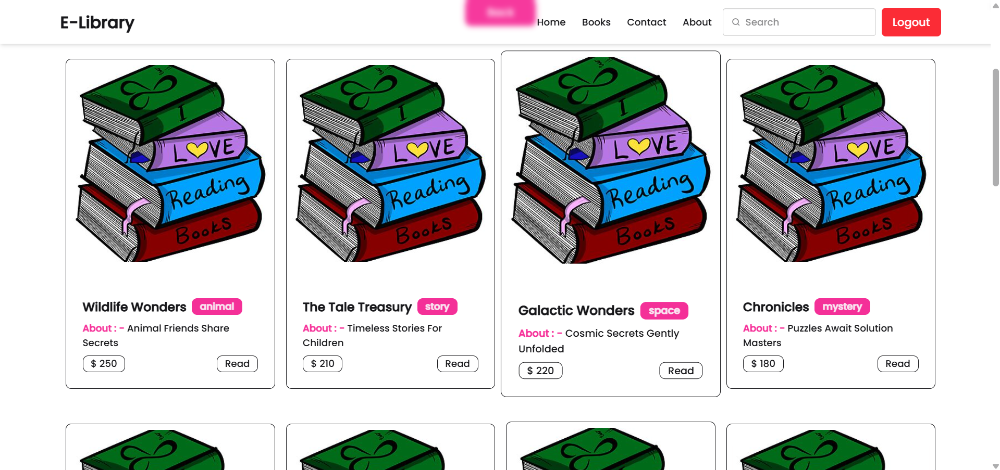
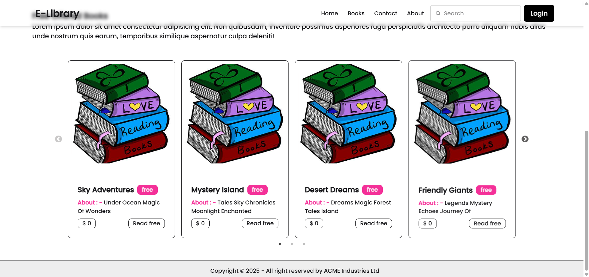
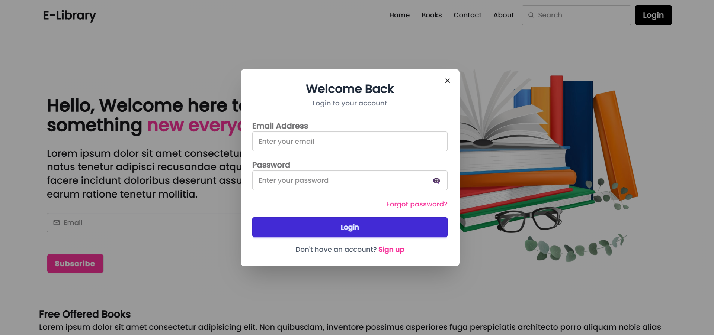
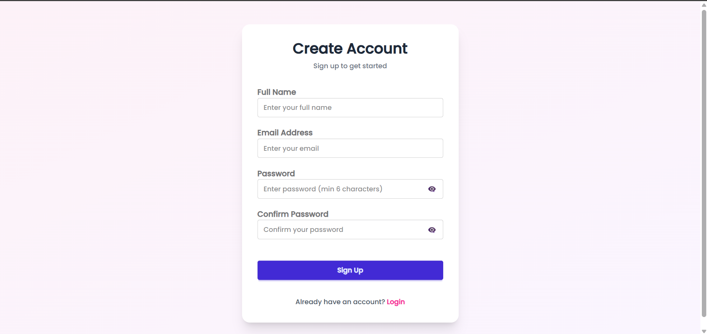
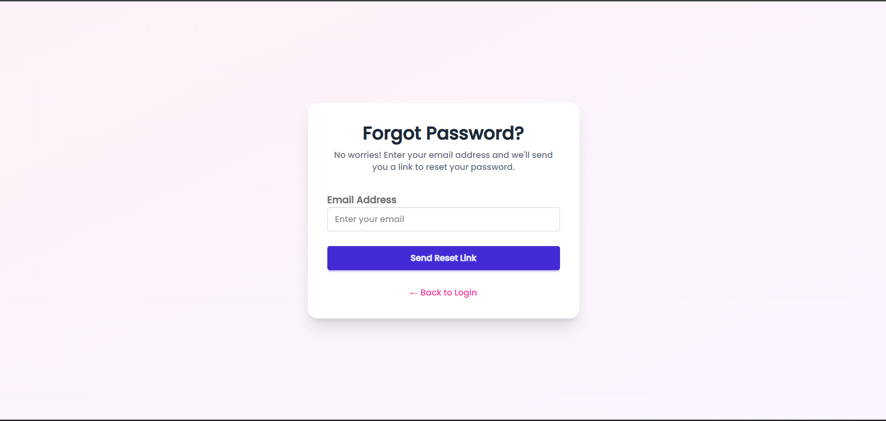

## 1. Project Title

**E-Library / Bookstore MERN Application**

---

## 2. Short Project Description

This is a full-stack MERN (MongoDB, Express, React, Node.js) web application for browsing and reading books.  
It provides public access to free books, authenticated access to paid books, a dedicated reading interface, and a complete email‑driven password reset flow using secure JWT‑based authentication and HTTP‑only cookies.

---

## 3. Tech Stack

### Frontend
- **React** (via Vite, `react` 19)
- **React Router DOM** (client-side routing)
- **Tailwind CSS** (v4, via `@tailwindcss/vite`) + **DaisyUI** (UI components)
- **Axios** (HTTP client)
- **Framer Motion** (page and component animations)
- **React Hook Form** (form handling and validation)
- **React Hot Toast** (toast notifications)
- **React Icons**, **react-simple-typewriter**, **react-slick** + **slick-carousel**

### Backend
- **Node.js**
- **Express** (v5)
- **MongoDB** with **Mongoose**
- **JWT** (`jsonwebtoken`) for authentication
- **bcrypt** for password hashing
- **cookie-parser** for reading HTTP‑only cookies
- **dotenv** for environment configuration
- **cors** for cross-origin requests
- **nodemailer** for transactional emails (password reset)

### Database
- **MongoDB** (collections: `users`, `books`, `freebooks`)

### Tooling & Build
- **Vite** (frontend bundler/dev server)
- **ESLint** (frontend linting)
- **Vercel** (backend deployment via `vercel.json`)

---

## 4. Key Features (Implemented)

- **User Authentication**
  - Email/password signup (`/user/signup`) with validation and hashed passwords.
  - Login (`/user/login`) issuing a signed JWT stored in an HTTP‑only cookie.
  - Logout (`/user/logout`) clearing the auth cookie.
  - Auth state persisted in `localStorage` and revalidated via `/user/me`.

- **Password Management**
  - “Forget Password” flow (`/user/forget-password`) that generates a secure one‑time reset token, stores its hash and expiry on the user, and sends a reset link via email (or returns it in development).
  - “Reset Password” flow (`/user/reset-password`) that validates the token, enforces minimum password length, and updates the stored password hash.

- **Protected & Public Content**
  - **Paid books** (from `book` collection) exposed through authenticated routes (`/book/allbooks`, `/book/read/:id`) and accessed only when the JWT cookie is valid.
  - **Free books** (from `freebook` collection) exposed via public routes (`/free/books`, `/free/read/:id`), displayed on the homepage carousel.

- **Reading Experience**
  - Dedicated Reader page that displays selected book details (image + story text) in a focused layout.
  - Route‑based navigation (`/reader`) that accepts book data via `location.state`.

- **Frontend UX**
  - Responsive layout built with Tailwind CSS and DaisyUI.
  - Animated page transitions using Framer Motion.
  - Reusable `Navbar`, `Footer`, `Banner`, `Books`, `Freebook`, `Cards`, and `Reader` components.
  - Toast feedback for auth and password flows.

- **Deployment Support**
  - Backend `vercel.json` configured to deploy `server.js` as a Vercel serverless function and route all paths to it.

All items above are directly backed by the existing source code and configuration in this repository.

---

## 5. Screenshots

> All of these files already exist in the `screenshots/` folder at the project root.

- **Home Page (Free Books Carousel)**  
  

- **Paid Books Page (Protected Books List)**  
  

- **Hero / Slider Section**  
  

- **Login Page**  
  

- **Signup Page**  
  

- **Forgot Password Page (Form)**  
  

- **Forgot Password Email (Mail UI Preview)**  
  

---

## 6. Folder Structure

```bash
BOOKSTORE/
├── README.md                    # Full-stack project documentation (this file)
├── screenshots/                 # App UI screenshots used in the README
│   ├── home.png
│   ├── login.png
│   ├── signup.png
│   ├── slider.png
│   ├── paid book page.png
│   ├── forget password.png
│   └── forget mail.png
├── backend/                     # Node + Express + MongoDB API
│   ├── configs/
│   │   └── mongodb.js           # MongoDB connection helper
│   ├── controllers/             # Route handlers (business logic)
│   │   ├── bookController.js    # Paid books: list & read
│   │   ├── freeBookController.js# Free books: list & read
│   │   └── userController.js    # Auth, password reset, current user
│   ├── middlewares/
│   │   └── userAuth.js          # JWT auth middleware (cookie-based)
│   ├── models/                  # Mongoose models / schemas
│   │   ├── bookModel.js         # Paid book schema
│   │   ├── freeBookModel.js     # Free book schema
│   │   └── userModel.js         # User schema (auth + reset token)
│   ├── routes/                  # Express routers
│   │   ├── bookRoute.js         # /book routes
│   │   ├── freeBookRoute.js     # /free routes
│   │   └── userRoute.js         # /user routes
│   ├── services/
│   │   └── emailService.js      # Nodemailer password reset email
│   ├── vercel.json              # Vercel deployment config (backend)
│   ├── package.json             # Backend dependencies & scripts
│   └── server.js                # Express app entrypoint
│
└── frontend/                    # React SPA (Vite)
    ├── public/                  # Static assets (e.g. logos)
    ├── src/
    │   ├── assets/              # Images & JSON book list (e.g. list.json)
    │   ├── components/          # Reusable UI components
    │   │   ├── Navbar.jsx
    │   │   ├── Login.jsx
    │   │   ├── Signup.jsx
    │   │   ├── ForgetPassword.jsx
    │   │   ├── ResetPassword.jsx
    │   │   ├── Books.jsx
    │   │   ├── Freebook.jsx
    │   │   ├── Reader.jsx
    │   │   ├── Banner.jsx
    │   │   ├── Footer.jsx
    │   │   └── Scrolltop.jsx
    │   ├── contexts/
    │   │   └── AuthContext.jsx  # Auth state and logout logic
    │   ├── pages/               # Route-level pages
    │   │   ├── Home.jsx
    │   │   ├── Bookspage.jsx
    │   │   ├── Readpage.jsx
    │   │   ├── About.jsx
    │   │   └── Contact.jsx
    │   ├── App.jsx              # Route definitions
    │   ├── main.jsx             # React root, router, providers
    │   └── index.css            # Global styles (Tailwind + custom)
    ├── eslint.config.js         # Frontend ESLint configuration
    ├── package.json             # Frontend dependencies & scripts
    ├── vite.config.js           # Vite config
    └── vercel.json              # SPA rewrites config for deployment
```

---

## 7. Setup & Run Instructions

### 7.1 Prerequisites

- **Node.js** (LTS recommended)
- **npm** (bundled with Node)
- **MongoDB** instance (local or hosted, e.g. MongoDB Atlas)

---

### 7.2 Clone the Repository

   ```bash
git clone <your-repo-url>
   cd BOOKSTORE
   ```

---

### 7.3 Backend Setup (`/backend`)

1. Install dependencies:
   ```bash
   cd backend
   npm install
   ```
   
2. Create a `.env` file in `backend/` with the following variables (see section **8. Environment Variables** for details):
   ```env
   PORT=3000
   HOSTNAME=localhost
   MONGODB_URI=mongodb://localhost:27017/your-db-name
   JWT_SECRET_KEY=your_jwt_secret_key

   # Email configuration (required in production for password reset emails)
   EMAIL_HOST=smtp.yourprovider.com
   EMAIL_PORT=587
   EMAIL_USER=your_email@example.com
   EMAIL_PASSWORD=your_email_password_or_app_password

   # Frontend URL used to generate reset links
   FRONTEND_URI=http://localhost:5173

   # Optional, but used in code paths:
   NODE_ENV=development
   ```

3. Start the backend server:
   ```bash
   npm start
   ```

   By default, the server listens on:
   - `http://localhost:3000`

---

### 7.4 Frontend Setup (`/frontend`)

1. Install dependencies:
   ```bash
   cd ../frontend
   npm install
   ```

2. Create a `.env` file (or `.env.local`) in `frontend/` for Vite:
   ```env
   VITE_BACKEND_URI=http://localhost:3000
   ```

3. Start the frontend dev server:
   ```bash
   npm run dev
   ```

   Vite will output the local URL (typically `http://localhost:5173`).

---

### 7.5 Accessing the App

- Open the frontend URL (e.g. `http://localhost:5173`) in your browser.
- Use the UI to:
  - Sign up and log in.
  - Browse free books on the home page.
  - Navigate to protected `/book` page once authenticated.
  - Open an individual book in the Reader page.
  - Use “Forgot Password” / “Reset Password” flows.

---

## 8. Environment Variables

All environment variables below are inferred directly from the code.

### Backend (`backend/.env`)

- **`PORT`**  
  Port on which the Express server listens. Defaults to `3000` in code if not set.

- **`HOSTNAME`**  
  Hostname used in the startup log message. Defaults to `localhost`.

- **`MONGODB_URI`**  
  Connection string for MongoDB, required by `mongoose.connect` in `configs/mongodb.js`.

- **`JWT_SECRET_KEY`**  
  Secret key for signing and verifying JWTs (used in `userController.js` and `userAuth.js`).

- **`EMAIL_HOST`**, **`EMAIL_PORT`**, **`EMAIL_USER`**, **`EMAIL_PASSWORD`**  
  SMTP configuration used by `emailService.js` to send password reset emails via Nodemailer. If missing, the app falls back to development behaviour by logging links to the console.

- **`FRONTEND_URI`**  
  Base URL of the frontend used to generate password reset links if `req.headers.origin` / `referer` are not available.

- **`NODE_ENV`**  
  Environment flag (`development` or `production`) used to adjust cookie security attributes and error handling for email configuration.

### Frontend (`frontend/.env` or `.env.local`)

- **`VITE_BACKEND_URI`**  
  Base URL of the backend API used by Axios calls throughout the React app (e.g. `/user/login`, `/user/me`, `/book/allbooks`, `/free/books`, etc.).

---

## 9. API Endpoints

All endpoints below are implemented in the existing Express routes and controllers.

### 9.1 Base URL

- Local development (default): `http://localhost:3000`

---

### 9.2 User Routes (`/user`)

- **`POST /user/signup`**  
  - **Description**: Register a new user, hash password, and set auth cookie.  
  - **Body**: `{ "name": string, "email": string, "password": string }`  
  - **Response**: `{ success, message, user: { name, email } }`  

- **`POST /user/login`**  
  - **Description**: Authenticate user credentials and issue JWT in HTTP‑only cookie.  
  - **Body**: `{ "email": string, "password": string }`  
  - **Response**: `{ success, message, user: { name, email } }`  

- **`POST /user/logout`**  
  - **Description**: Clear the `token` cookie to log out the user.  
  - **Response**: `{ success, message }`  

- **`POST /user/forget-password`**  
  - **Description**: Generate password reset token, store hashed token & expiry on the user, and send an email (or return the token in development if email unconfigured).  
  - **Body**: `{ "email": string }`  
  - **Response** (success): includes `message`, and optionally `resetToken` / `resetLink` in development.  

- **`POST /user/reset-password`**  
  - **Description**: Reset password using a one‑time token.  
  - **Body**: `{ "token": string, "password": string }`  
  - **Response**: `{ success, message }`  

- **`GET /user/me`** (protected)  
  - **Description**: Get the currently authenticated user’s basic profile.  
  - **Auth**: Requires valid `token` cookie (handled by `authMiddleware`).  
  - **Response**: `{ success, user: { name, email } }`

---

### 9.3 Book Routes (`/book`) – Protected

All routes below require a valid JWT cookie, enforced by `authMiddleware`.

- **`GET /book/allbooks`**  
  - **Description**: Fetch all paid books from the `book` collection.  
  - **Response**: `{ success, book: [ { _id, name, title, price, category, ... } ] }`  

- **`GET /book/read/:id`**  
  - **Description**: Fetch a single paid book by its MongoDB `_id`.  
  - **Response**: `{ book: { _id, name, title, price, category, ... } }`

---

### 9.4 Free Book Routes (`/free`) – Public

- **`GET /free/books`**  
  - **Description**: Fetch all free books from the `freebook` collection.  
  - **Response**: raw array of freebook documents.  

- **`GET /free/read/:id`**  
  - **Description**: Fetch a single free book by its MongoDB `_id`.  
  - **Response**: `{ book: { _id, name, title, price, category, ... } }`

---

## 10. Authentication & Authorization Flow

The authentication system is fully implemented and based on JWT stored in HTTP‑only cookies, with additional client‑side state in React.

- **Signup**
  - Frontend (`Signup.jsx`) sends `name`, `email`, `password` to `POST /user/signup`.
  - Backend validates inputs, checks for existing user, hashes password using `bcrypt`, stores user in MongoDB, signs a JWT with `_id` and `email`, and sets an HTTP‑only `token` cookie.
  - Frontend stores minimal user info in `localStorage` and updates `AuthContext` state.

- **Login**
  - Frontend (`Login.jsx`) sends credentials to `POST /user/login` with `withCredentials: true`.
  - Backend validates credentials, compares hash with `bcrypt`, issues a new JWT, and updates the `token` cookie.
  - Frontend updates `AuthContext` and `localStorage` on success.

- **Protected Backend Routes**
  - `authMiddleware` (`userAuth.js`) reads `req.cookies.token`, verifies it with `JWT_SECRET_KEY`, and if valid, attaches `userId` and `userEmail` to the request before calling `next()`.
  - If the token is missing, expired, or invalid, it returns appropriate 401/500 errors.
  - Paid book routes (`/book/allbooks`, `/book/read/:id`) and `/user/me` all use this middleware.

- **Protected Frontend Routes**
  - `AuthContext.jsx` exposes `authUser` and `loading` state.
  - On app mount, `AuthContext` checks `localStorage` and validates the session via `GET /user/me` (with `withCredentials: true`). If invalid, it clears local state.
  - `App.jsx` protects the `/book` route by rendering `<Bookspage />` only when `authUser` is present; otherwise it redirects (`<Navigate to="/" replace />`).

- **Logout**
  - `Navbar.jsx` calls the `logout` function from `AuthContext`, which sends `POST /user/logout` and then clears `authUser` and `localStorage` on the client.

- **Password Reset**
  - `ForgetPassword.jsx` posts the user’s email to `/user/forget-password`.
  - Backend generates a random token (`crypto.randomBytes`), stores its **hashed** version and expiry on the user document, and uses `emailService` to send a reset link of the form:  
    `<FRONTEND_URI>/reset-password/<token>`.
  - `ResetPassword.jsx` reads the `:token` from the URL and sends it along with the new password to `POST /user/reset-password`.  
  - Backend validates token and expiry, hashes the new password, updates the user, and clears the reset token fields.

No role‑based authorization is implemented; access control is binary (authenticated vs unauthenticated).

---

## 11. Database Models / Schema Overview

All schemas are implemented using Mongoose in `backend/models`.

### 11.1 `User` (`userModel.js`)

Fields:
- `name`: `String`, required, trimmed, min length 2.
- `email`: `String`, required, unique, lowercase, trimmed, regex‑validated.
- `password`: `String`, required, min length 6 (stores the bcrypt hash).
- `resetToken`: `String | null`, hashed token for password reset.
- `resetTokenExpiry`: `Date | null`, expiry for the reset token.
- `isEmailVerified`: `Boolean`, default `false` (flag not currently used in auth logic).
- Timestamps: `createdAt`, `updatedAt` via schema options.

### 11.2 `Book` (`bookModel.js`)

Fields:
- `name`: `String`, required.
- `title`: `String`, required.
- `price`: `Number`, required.
- `category`: `String`, required (used to classify books; frontend also expects fields like `photo` and `story` when reading, based on usage in `Reader.jsx`).

### 11.3 `FreeBook` (`freeBookModel.js`)

Fields:
- `name`: `String`, required.
- `title`: `String`, required.
- `price`: `Number`, required.
- `category`: `String`, required (frontend further filters by `category === 'free'`).

> Note: The exact schema fields used for the reader content (e.g. `photo`, `story`) must be present in your actual database documents; they are referenced in the frontend but not strictly defined in the current Mongoose schemas.

---

## 12. Live Demo Link

- **Live Demo**: [https://e-library-frontend-eta.vercel.app/](https://e-library-frontend-eta.vercel.app/)

---

## 13. GitHub Repository Link

The GitHub repository URL is not stored in the codebase.  
Update this section with your actual repo URL, for example:

- **GitHub**: `https://github.com/aashish-arya/E-library`

---

## 14. Future Improvements

Based solely on the current implementation, these are realistic next steps:

- **Stronger Type Safety & Validation**
  - Add request/response validation (e.g. using Zod/Joi) and stricter types via TypeScript.

- **Role-Based Authorization**
  - Introduce roles (e.g. admin, user) and guard admin operations (adding/removing books) via middleware and UI.

- **Book Management UI**
  - Implement admin UI for creating, editing, and deleting books instead of seeding documents manually.

- **Enhanced Reader Experience**
  - Add pagination, bookmarks, reading progress, and font/theme customization for the Reader page.

- **Improved Error Handling & Logging**
  - Centralize error handling middleware on the backend and structured logging for production debugging.

- **Email Verification**
  - Leverage `isEmailVerified` to implement an email verification flow before granting access to protected content.

- **Test Coverage**
  - Add unit and integration tests for controllers, middleware, and critical React components.

---

## 15. Challenges Faced & Learnings

From the structure and code patterns in this project, the following challenges and learnings are evident:

- **Secure Auth with Cookies and JWT**
  - Correctly configuring HTTP‑only cookies, handling CORS with `credentials: true`, and ensuring secure flags in production requires careful coordination between frontend and backend.

- **Robust Password Reset Flow**
  - Designing a secure reset mechanism using hashed tokens, expiry times, and environment‑aware email handling (dev vs production) deepens understanding of security best practices and real‑world error scenarios (email misconfiguration, missing `FRONTEND_URI`, etc.).

- **Full-Stack State Management**
  - Keeping frontend auth state in sync with server sessions (`AuthContext` + `/user/me`) teaches how to reconcile optimistic local storage with authoritative backend validation.

- **Deployment Readiness**
  - Preparing a Node/Express app for Vercel serverless deployment while separating frontend and backend concerns encourages thinking about environment variables, route routing, and build outputs.